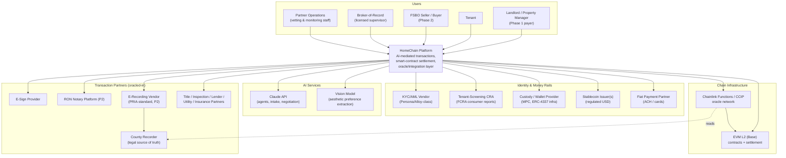

# ARC-03 — Context and Scope

| | |
|---|---|
| **Doc ID** | ARC-03 · arc42 §3 |
| **Version** | 0.1.0-draft · 2026-06-11 |
| **Status** | Draft for founder review |

## 3.1 Business Context (C4 Level 1)

## 3.2 External Systems & Interface Contracts

| External system | Direction | Interface style | Trust stance |
|---|---|---|---|
| KYC/AML vendor | Out + webhook | REST + signed webhooks | Trusted for identity verdicts; results cached with expiry |
| Tenant-screening CRA | Out + webhook | REST (FCRA-permissioned pulls) | Consumer reports; adverse-action duties attach to us/landlord |
| Custody / wallet provider | Out | REST/gRPC + policy engine | Holds or co-holds keys; transaction policy enforced provider-side too |
| Stablecoin issuer(s) | Indirect (on-chain) + status API | ERC-20 on L2; issuer status feeds | Freeze/seizure capable (GENIUS); multi-issuer abstraction |
| Fiat payment partner | Out + webhook | REST | Fallback rail; NACHA rules apply |
| Claude API / vision model | Out | HTTPS API w/ tool use | **Untrusted input processor** — outputs validated downstream; never final say on protected-class or fund logic |
| Chainlink Functions / CCIP | Bidirectional | On-chain request/fulfill + DON jobs | N-of-M attestation; disagreement → escalation, never silent execution |
| EVM L2 (Base) | Bidirectional | JSON-RPC (redundant providers) + event indexing | Soft-confirmation vs. finality policy (ARC-08 §8.4); sequencer outage tolerated |
| E-sign provider | Out + webhook | REST | ESIGN/UETA-compliant ceremony; evidence package archived to WORM |
| RON / e-recording vendors (P2) | Out + webhook | REST (PRIA standards) | Per-state availability gated by ruleset |
| County recorder | Via e-recording vendor; read oracle | e-recording submission; public-record reads | **Authoritative for title**; platform mirrors, never replaces |
| Vertical partners (title, inspection, lender, utility, insurance) | Connector SDK | Signed, versioned connectors in sandboxed host | Curated program only (README §3A.2); continuous monitoring |

## 3.3 Scope Boundary

Carried from README §3.3 and binding on the architecture:

- **Build:** onboarding/profiles, AI intake + matching, negotiation orchestration, smart-contract lease + escrow, stablecoin rent collection, geo-verified walkthrough, the oracle/integration layer itself, compliance/audit/broker tooling.
- **Integrate (oracle-in):** mortgage/refi, utilities, property tax & county data, title search/insurance, inspections, insurance, payment assistance.
- **Out of scope (hard):** legal title transfer on-chain (vision only), issuing a stablecoin/token, unlicensed brokerage activity, secondary-market trading, any optimization on protected classes, non-US jurisdictions at MVP.

**Scope additions surfaced by this architecture effort** (recommended, see ANL-02): FCRA adverse-action workflow (G-01), per-state deposit-rail configuration (G-02), fiat fallback rail (G-04), maintenance-request integration path (G-12).
