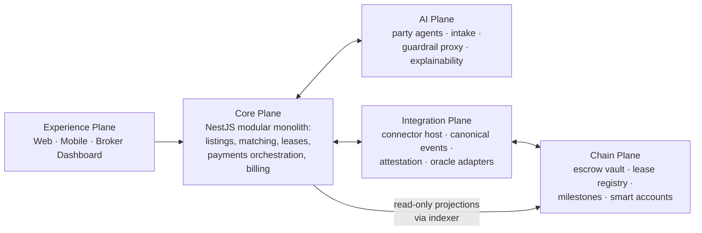

# ARC-04 — Solution Strategy

| | |
|---|---|
| **Doc ID** | ARC-04 · arc42 §4 |
| **Version** | 0.1.0-draft · 2026-06-11 |
| **Status** | Draft for founder review |

The architecture is organized around **five planes with hard boundaries**, because the platform's existential risks (README: R-04 licensing, R-05 fair housing, R-01 title, R-13 partner compromise) are *containment* problems, not feature problems.

## 4.1 Strategy Decisions at a Glance

| # | Strategy | Rationale | ADR |
|---|---|---|---|
| S-1 | **Modular monolith** (NestJS/TypeScript) with enforced module boundaries; extract services only when scale demands | Small team, fastest iteration, one deployable; boundaries pre-drawn so later extraction is mechanical | ADR-0003 |
| S-2 | **Minimal trust kernel on-chain.** Chain holds: escrow funds, payment settlement, attested milestone events, salted commitments, deed-references. Everything mutable/private stays in PostgreSQL | Smallest audited surface; privacy (R-02); fraud reversibility stays with courts/county (R-01) | ADR-0004 |
| S-3 | **Immutable escrow vault, upgradeable periphery.** The fund-holding contract is minimal and non-upgradeable; logic contracts evolve behind timelock+multisig | An upgradeable vault concentrates custody risk in whoever holds the upgrade key — refines README's blanket "upgradeable proxy" | ADR-0014 |
| S-4 | **AI plane is isolated and untrusted.** Party agents run in separated contexts with an information barrier; all counterparty content treated as hostile (prompt injection); agents emit **structured term-sheet deltas**, not free-form actions; deterministic guardrail proxy outside the models | R-05 hard wall; TR-01 injection; explainability (DR-5); "designated agency" analogue for dual representation | ADR-0009, ADR-0016 |
| S-5 | **Rule-based matching first**, semantic/vector scoring layered later as a bounded component behind the same explainability log | Founder risk R-03 mitigation; explainable from day one | ADR-0010 |
| S-6 | **Saga-orchestrated transaction pipeline** with transactional outbox; every cross-plane step idempotent, compensable, and resumable; human approval gates are first-class workflow states | Lease/closing pipelines span days and systems; partial failure is the normal case | ADR-0015 |
| S-7 | **Compliance as configuration.** Versioned, attorney-approved per-state rulesets with effective dates; every generated document records the ruleset version used | R-12; new state = config + counsel sign-off, not code | ADR-0013 |
| S-8 | **Custody via licensed partner by default** (Variant B); platform-side custody (Variant A) only after money-transmission counsel clears it per state | C-L8; avoids accidental unlicensed money transmission — the rental-side cousin of R-04 | ADR-0007 |
| S-9 | **Dual rails for money.** Stablecoin escrow/rent as the strategic rail; ACH fiat fallback for adoption, issuer-freeze resilience (R-08), and jurisdictions restricting electronic-only payment | C-L13; availability quality goal | ADR-0018 |
| S-10 | **Curated connector program** with signed, versioned connectors in a sandboxed host; vetting pipeline is a product feature | R-13; the moat per README §3A.2 | ADR-0008 |
| S-11 | **Audit log as first-class subsystem**: hash-chained append-only log, daily Merkle root anchored on-chain; documents in WORM storage | DR-4; tamper-evidence cheaply, without putting data on-chain | ADR-0012 |

## 4.2 The Five Planes

Boundary rules (enforced in review and CI):

1. The **AI plane never calls money, chain, or partner systems**. It returns structured proposals to the Core plane, which validates and routes them.
2. The **Chain plane is reached only through the Integration plane** (writes) and the indexer (reads). No ad-hoc RPC calls from business logic.
3. **Protected-class data never enters** the AI plane's matching/negotiation feature space — enforced by schema allowlist at the Core/AI boundary, not by prompt instructions.
4. Connectors execute **only inside the sandboxed host** with per-connector egress allowlists.

## 4.3 Delivery Increments (within README Phases 0–1)

> **2026-06-11 update:** the founder set a 30-day client-intake target. [PLN-01](../planning/mvp-30-day.md) + [ADR-0019](../adr/ADR-0019-mvp-30-day-concessions.md) re-scope the Increment 0/1a boundary into a single 30-day MVP (processor-rail payments, no custody, no user funds on-chain). Increments 1b/1c below are unchanged, including their entry triggers.

The scope's Phase 1 is large (KYC + custody + contracts + AI + mobile + broker tooling). To hold the 48-hour lease-execution objective while sequencing risk, delivery is sliced into increments that each produce a usable product:

| Increment | Contents | Money rail | Exit criterion |
|---|---|---|---|
| **0 — Walking skeleton** (maps to README Phase 0) | Landlord onboarding, units/listings, tenant intake, rule-based matching, lease generation + e-sign, audit log v1; contracts built + fuzzed on Base Sepolia in parallel | None (documents only) | Counsel sign-off on structure; lease executed end-to-end on testnet |
| **1a — First revenue** | Rent collection live via **ACH partner rail**; broker dashboard v1; state ruleset engine (launch states) | ACH | First 10 landlords collecting rent; zero compliance findings |
| **1b — On-chain settlement** | Custody partner integrated; stablecoin rent + deposit escrow on mainnet after independent audit; issuer-freeze runbook tested | ACH + stablecoin | Audit passed; pilot cohort settling on-chain |
| **1c — Differentiators** | Dual-agent negotiation GA; mobile geo-verified walkthrough; aesthetic preference ingestion; deposit automation w/ deductions | Both | README Phase-1 gate: 50 landlords / 250 units, clean compliance record |

This ordering means the **chain is never the critical path for revenue**, while remaining the strategic settlement layer per the thesis — the platform's deadline-bearing obligations always have a non-chain execution path (quality goal #6).
