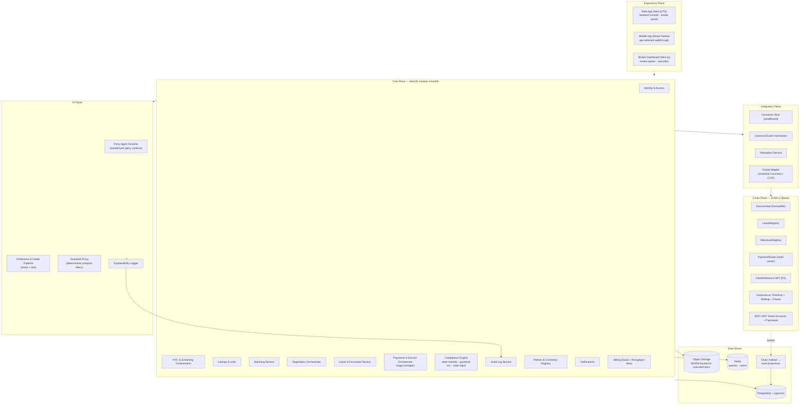

# ARC-05 — Building Block View

| | |
|---|---|
| **Doc ID** | ARC-05 · arc42 §5 |
| **Version** | 0.1.0-draft · 2026-06-11 |
| **Status** | Draft for founder review |

## 5.1 Container Diagram (C4 Level 2)

## 5.2 Container Responsibilities & Interfaces

| Container | Responsibility | Key interfaces | README module |
|---|---|---|---|
| Web App | Landlord console, tenant portal, listing browse, approvals UX | Core REST/JSON + SSE for negotiation updates | A, B, D |
| Mobile App | Walkthrough capture: device-attested location, photos, both-party confirmation | Core REST; Play Integrity / App Attest | E |
| Broker Dashboard | Supervision queue, approve/reject regulated actions, override/freeze, audit search | Core REST (privileged RBAC) | F |
| Identity & Access | AuthN (passwordless/OIDC), RBAC, organizations, **agency relationships** (PM manages owner's units) | Internal | A |
| KYC & Screening | Orchestrates KYC vendor + FCRA screening CRA; stores verdicts not raw reports where avoidable; adverse-action workflow | Vendor REST/webhooks | A |
| Listings & Units | System of record for mutable property data (photos, price, description) — explicitly off-chain | Internal + public read API | C |
| Matching Service | Hard filters + weighted allowlisted scoring; later +pgvector semantic component; emits explanation objects | Internal; reads allowlisted feature store only | B |
| Negotiation Orchestrator | Drives dual-agent rounds; holds term-sheet state machine; enforces human approval gates; routes validated proposals | AI plane (structured), Web (SSE) | B |
| Lease & Document Service | State-templated document generation (attorney-reviewed templates), e-sign ceremony, document versioning, WORM archival | E-sign vendor; S3 | F |
| Payments & Escrow Orchestrator | Saga manager for funding, rent runs, deposit lifecycle, disbursement, refunds; dual-rail (stablecoin/ACH); dunning | Integration plane; ACH partner; Billing | D |
| Compliance Engine | Per-state ruleset evaluation; fair-housing guardrail service (shared with AI plane); broker case management; disclosure scheduling | Internal; Broker Dashboard | F |
| Audit Log Service | Hash-chained append-only event log; daily Merkle root → on-chain anchor; verification API | All planes write; anchor via Integration plane | F |
| Partner & Connector Registry | Vetting workflow, connector signing/versioning, monitoring, offboarding | Connector Host | E |
| Billing | Per-unit SaaS subscription, rent-throughput bps fees; parameterized pricing | Payment partner | — |
| Party Agent Runtime | Two isolated agent contexts per transaction; per-party secret vault (max budget etc.); LLM tool-use harness | Claude API; Guardrail Proxy | B |
| Preference & Intake Pipeline | Conversational intake; vision extraction from consented boards/images → style descriptors on the allowlist | Vision model API | B |
| Guardrail Proxy | Deterministic pre/post filters: schema allowlist in, bounds/policy validation out; protected-class firewall | Wraps every model call | B/F |
| Explainability Logger | Captures every prompt, model version, output, validation verdict → Audit Log | Audit | B/F |
| Connector Host | Executes signed partner connectors in sandbox w/ egress allowlists, resource limits | Partner systems | E |
| Canonical Event Normalizer | Maps connector/oracle payloads to the canonical event schema; rejects non-conforming | Internal bus | E |
| Attestation Service | Signs verified milestone events (platform key, HSM-backed); assembles N-of-M evidence bundles | Oracle Adapter | E |
| Oracle Adapter | Chainlink Functions jobs (off-chain data → chain), CCIP messaging; retries, disagreement detection | Chain plane | E |
| EscrowVault | Holds stablecoin for deposits/earnest money; **immutable**; funds move only to the agreement's predefined party set | PaymentRouter, Governance | D |
| LeaseRegistry | On-chain reference: lease terms hash, parties (smart accounts), payment schedule parameters, status | — | D |
| MilestoneRegistry | Attested milestone events with provenance (who attested, evidence hash, timestamp) | — | E |
| PaymentRouter | Stablecoin transfer execution, multi-issuer abstraction, allowance/session-key based rent collection | Smart accounts | D |
| DeedReference NFT (P2) | Pointer to county instrument (book/page/instrument no. + document hash); explicitly non-title | — | C |
| Governance | Multisig + timelock for periphery upgrades and pause; emergency council policy | All contracts | F |
| Smart Accounts + Paymaster | ERC-4337 accounts per user; gas sponsored by platform paymaster; session keys scoped to rent terms | Custody provider | A |
| Chain Indexer | Ingests contract events → PostgreSQL projections; reconciliation job (projection vs. chain state) | PG | — |

## 5.3 Selected Component Detail (C4 Level 3)

### 5.3.1 Payments & Escrow Orchestrator

| Component | Role |
|---|---|
| Saga Engine | Durable state machines per business transaction (lease funding, monthly rent run, deposit return, closing); compensation steps defined per stage |
| Rail Router | Chooses stablecoin vs. ACH per state ruleset + party capability; never silently switches rails mid-obligation |
| Dunning & Grace | Retry schedule, late-fee computation via Compliance Engine (jurisdiction-aware), notice generation |
| Reconciliation | Compares indexer projections, custody-provider balances, ACH partner reports vs. internal ledger; discrepancies open incidents, never auto-fix |
| Internal Ledger | Double-entry record of every obligation and movement across both rails — the platform's accounting truth |

### 5.3.2 Compliance Engine

| Component | Role |
|---|---|
| Ruleset Store | Versioned per-state parameter sets (deposit caps, return deadlines, late-fee caps, notice periods, disclosures, RON/e-recording availability, deposit-rail legality) with effective dates |
| Ruleset Workflow | Draft → attorney review → approved → active; generated documents stamp the ruleset version used |
| Guardrail Service | The deterministic fair-housing filter: feature allowlist enforcement, output validation, paired-test harness hooks (shared by Matching + AI plane) |
| Case Management | Broker review queues with SLAs, four-eyes actions, override/freeze with lawful-order intake |
| Disclosure Scheduler | State-required disclosures generated and delivery-tracked per transaction stage |

### 5.3.3 Party Agent Runtime (detail in DSN-04)

| Component | Role |
|---|---|
| Agent Context Manager | One isolated context per party per transaction; no shared memory; per-party secret vault (reservation prices, constraints) readable only by that party's agent |
| Negotiation Protocol Adapter | Agents exchange **structured term-sheet deltas** (price, dates, clauses from a clause library) — never free-form instructions; deltas schema-validated before crossing the barrier |
| Tool-Use Harness | Whitelisted read-only tools (listing facts, comps, ruleset bounds); no tool can move money, sign, or write state |
| Sanitizer | Counterparty-authored text (listing descriptions, messages) wrapped and treated as data; injection heuristics + structural separation |

## 5.4 Mapping to README Feature Modules

| README module | Owning containers |
|---|---|
| A — Identity, Onboarding & Verification | Identity & Access, KYC & Screening, Smart Accounts (custody) |
| B — AI Agent & Matching Engine | AI Plane (all four), Matching Service, Negotiation Orchestrator |
| C — On-Chain Listings, Bids & Ownership Reference | Listings & Units (off-chain detail), commit-reveal commitments via Integration plane (ADR-0011), DeedReference NFT (P2) |
| D — Smart-Contract Lease & Escrow | EscrowVault, LeaseRegistry, PaymentRouter, Payments & Escrow Orchestrator |
| E — Geo-Verified Conditions & Oracle Integrations | Mobile App, Integration Plane (all four), Partner & Connector Registry, MilestoneRegistry |
| F — Compliance, Audit & Human-in-the-Loop | Compliance Engine, Audit Log Service, Broker Dashboard, Lease & Document Service, Governance |

Full feature-level traceability: [ANL-01](../analysis/requirements-traceability-matrix.md).
