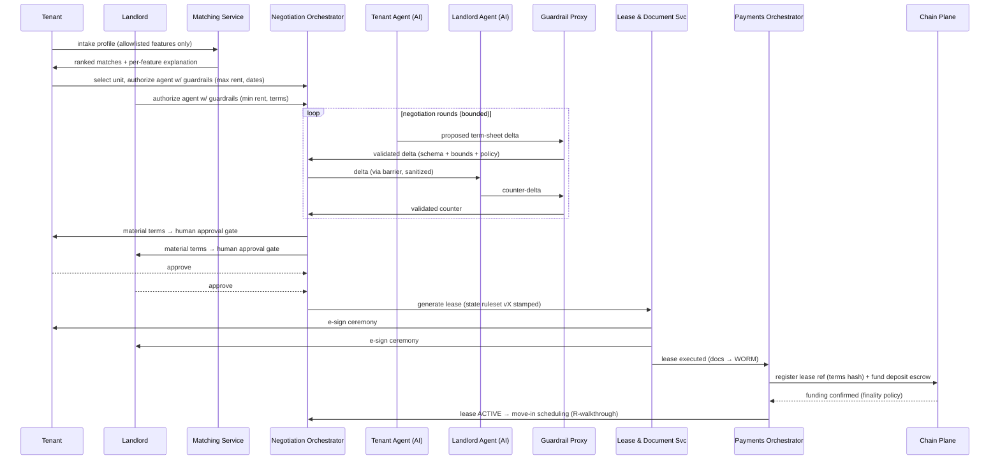

# ARC-06 — Runtime View

| | |
|---|---|
| **Doc ID** | ARC-06 · arc42 §6 |
| **Version** | 0.1.0-draft · 2026-06-11 |
| **Status** | Draft for founder review |

Eight scenarios cover the architecturally significant behavior. Each lists its primary failure paths — partial failure is the design case, not the exception (ADR-0015).

## R1 — Landlord Onboarding & KYC

1. Landlord registers (Identity & Access); creates organization; invites staff (RBAC) or is linked to owner via agency relationship.
2. KYC Orchestration starts vendor verification (IDV + sanctions/OFAC). Verdict cached with expiry; raw vendor artifacts stay vendor-side where possible.
3. On `kyc.approved`: custody provider provisions an ERC-4337 smart account (Variant B: account at licensed partner); wallet linked to verified identity.
4. Unit/listing profiles created (off-chain, mutable). Audit events at every step.

**Failure paths:** KYC review/rejection → manual review case (Compliance); custody provisioning failure → retry saga, landlord can still list (money rails blocked until provisioned).

## R2 — Match → Negotiate → Lease → Fund → Move-In (the core Phase-1 flow)

- Screening (credit/income) runs via the FCRA CRA **between match and negotiation**, with tenant consent; a decline triggers the adverse-action workflow (DSN-06 §6).
- Every agent round is logged with model version + prompts by the Explainability Logger.
- If a party rejects at an approval gate, the negotiation reopens or terminates — agents never auto-accept material terms (DR-1).

**Failure paths:** agent round limit exceeded → human takeover; guardrail rejection → delta returned to agent with machine-readable reason; e-sign abandoned → saga timeout, escrow never funded; funding fails → lease held in PENDING_FUNDS with expiry + notices.

## R3 — Monthly Rent Run

1. Payments Orchestrator opens a rent run per active lease (schedule from LeaseRegistry parameters mirrored in PG).
2. **Stablecoin rail:** PaymentRouter executes transfer from tenant smart account under a **scoped session key/allowance** — bounded by (amount ≤ rent, period = monthly, payee = lease's escrow/landlord route). No open-ended "pull" exists (ADR-0017).
3. **ACH rail:** partner debit per NACHA authorization.
4. Success → receipt event, throughput fee accrued (Billing), audit entry. Tenant's funding shortfall → dunning saga: retries, grace period, jurisdiction-aware late fee (Compliance Engine), notices.

**Failure paths:** sequencer/chain outage → run marked DEFERRED_CHAIN, obligation tracked off-chain, retried; legal due-date logic never depends on chain liveness (quality goal #6). Issuer freeze mid-run → R5. Session key expired/revoked → tenant re-authorization flow, treated as missed-payment timeline per ruleset.

## R4 — Deposit Return & Dispute

1. Lease ends → walkthrough evidence (R6 below) → landlord proposes deductions w/ documentation within the state deadline (ruleset).
2. Tenant accepts → EscrowVault splits per agreement (only to predefined parties); receipts + audit.
3. Tenant disputes → escrow frozen in DISPUTED; case to broker/ops; resolution (agreement, mediation, or court order) recorded; vault executes resolution. Statutory deadline timers run in the orchestrator with notices — **the platform never lets an on-chain state silently outlast a legal deadline**.

## R5 — Stablecoin Issuer Freeze (R-08 runbook)

1. Issuer freeze/seizure event detected (issuer status feed + on-chain monitor).
2. PaymentRouter circuit-breaker marks affected issuer rail SUSPENDED; in-flight sagas pause at last consistent step.
3. Obligations re-routed: alternate issuer (multi-issuer abstraction) or ACH fallback per party consent and ruleset.
4. Affected escrow balances inventoried; parties + broker notified; legal hold case opened; regulator-facing report assembled from audit log.

## R6 — Geo-Verified Walkthrough (move-in/move-out)

1. Mobile app captures: device attestation (Play Integrity / App Attest), GNSS + network cross-signals, timestamped photos w/ challenge nonce.
2. Evidence bundle hashed → Attestation Service; **both parties confirm** in-app.
3. Milestone attested on MilestoneRegistry (evidence hash + signers). Walkthrough is **medium-assurance**: it gates deposit timelines, but never solely releases large funds (README fail-safe; R-09).

**Failure paths:** attestation fails / signals disagree → manual confirmation path with photos + both-party signatures; flagged in audit as lower-assurance.

## R7 — Phase-2 Closing Pipeline (forward design)

Offer (commit-reveal per ADR-0011) → mutual acceptance → earnest money to EscrowVault → inspection/title/financing milestones attested by validated partners (N-of-M per tier) → closing docs generated → e-sign + **RON** where permitted → **good-funds gate** per state → disbursement → e-recording via PRIA vendor → county confirmation → DeedReference NFT minted pointing at the recorded instrument → oracle mirrors recorded status.

**Failure paths:** title defect → saga branch to cure period; financing falls through → contingency-governed earnest-money disposition (predefined in the agreement); recording rejected → resubmission workflow; **funds never disburse before the good-funds + recording conditions the state requires**.

## R8 — Contract Upgrade / Emergency Pause

1. Periphery upgrade proposed → multisig approval → timelock delay (public) → execution; EscrowVault itself is immutable (ADR-0014).
2. Emergency: Pauser (multisig, no timelock) can halt new operations; **withdraw-to-party paths remain open** — pause can stop new business, never strand user funds.
3. Every governance action lands in the audit log and triggers user-facing disclosure where material.
