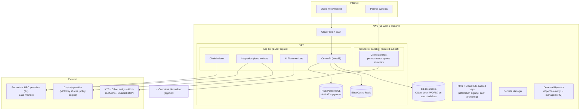

# ARC-07 — Deployment View

| | |
|---|---|
| **Doc ID** | ARC-07 · arc42 §7 |
| **Version** | 0.1.0-draft · 2026-06-11 |
| **Status** | Draft for founder review |

## 7.1 Environments

| Env | Purpose | Chain | Money | Partners |
|---|---|---|---|---|
| dev | Feature work | Base Sepolia (testnet) | None | Vendor sandboxes |
| staging | Pre-release validation; oracle + connector simulation; bias-harness full runs | Base Sepolia | Test stablecoin / ACH sandbox | Sandboxed connectors |
| prod | Live | Base mainnet | Regulated stablecoin + ACH | Vetted connectors only |

Promotion gates: staging → prod requires green CI (incl. fair-housing paired tests + contract invariant suite), and for any contract change: independent audit (first deploy) or audit-diff review (subsequent), multisig + timelock ceremony.

## 7.2 Reference Deployment (AWS, managed-first per C-O4)

## 7.3 Key & Signer Topology (highest-sensitivity assets)

| Key / signer | Holder | Protection | Used for |
|---|---|---|---|
| User smart-account keys | Custody provider (Variant B default, ADR-0007) | MPC shares + provider policy engine (limits mirror our session-key scopes) | User transactions |
| Platform attestation key | Platform | KMS/HSM, non-exportable; rotation policy | Signing milestone attestations |
| Audit anchor key | Platform | KMS/HSM | Daily Merkle-root anchoring tx |
| Contract governance multisig | Founder + independent signers (3-of-5 target; named in key ceremony doc) | Hardware wallets; geographically separated | Upgrades (behind timelock), pauser |
| Paymaster funding key | Platform | Custody provider policy-bound | Gas sponsorship, balance-capped |

Key ceremony, rotation schedule, and loss/compromise runbooks are release-blocking deliverables before mainnet (tracked in ANL-04).

## 7.4 Availability, DR & BCP

| Aspect | Target (initial) | Mechanism |
|---|---|---|
| Core API availability | 99.9% | Multi-AZ Fargate + RDS Multi-AZ |
| RPO | ≤ 5 min | PITR on RDS; S3 versioning + replication |
| RTO | ≤ 4 h | IaC-recreatable stack (Terraform), runbooks, restore drills quarterly |
| Chain outage tolerance | 24 h+ without breaching legal deadlines | Dual rails; DEFERRED_CHAIN saga states; obligations tracked off-chain (R3) |
| RPC provider failure | Transparent | 2+ providers, health-checked failover; indexer re-sync from last checkpoint |
| Custody provider outage | Degraded (no new on-chain ops) | ACH fallback for time-critical obligations; incident comms templates |
| Region loss | Cold standby acceptable at MVP | Cross-region backups; documented manual failover |

**The chain is not a backup concern in the usual sense** — contract state is globally replicated — but *our view of it* is: the indexer checkpoint + reconciliation design (ARC-08 §8.4) is the recovery mechanism for projections.

## 7.5 Network & Tenant Isolation

- Connector sandbox subnet: no inbound from app tier except the host control channel; per-connector egress allowlists (R-13).
- AI plane workers have egress only to model APIs; no database write access except via Core APIs (defense in depth for TR-01).
- Single-database multi-tenancy with row-level tenancy keys + RLS policies at MVP; org-level export/delete tooling for privacy obligations.
