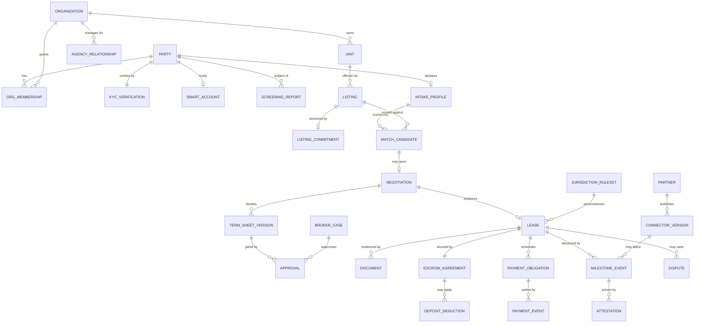

# DSN-01 — Data Model

| | |
|---|---|
| **Doc ID** | DSN-01 |
| **Version** | 0.1.0-draft · 2026-06-11 |
| **Status** | Draft for founder review |

Conceptual model only — table-level DDL is an implementation artifact. PostgreSQL; module-scoped schemas matching ARC-05 containers; RLS tenancy keys on org-scoped tables.

## 1. Core Entity-Relationship View

## 2. Entity Notes (the non-obvious ones)

| Entity | Key design points |
|---|---|
| **PARTY** | A verified legal person/entity. Identity binding chain (KYC ↔ account ↔ wallet ↔ signatures) per ARC-08 §8.1. PII fields carry data-classification tags. |
| **AGENCY_RELATIONSHIP** | PM org ⇄ owner org/party, scoped permissions + effective dates; every action records actor *and* principal (Marcus persona). |
| **SMART_ACCOUNT** | Address, custody variant (A/B), provider ref, session-grant inventory (scope, expiry, status) — grants are first-class rows (ADR-0017). |
| **SCREENING_REPORT** | FCRA artifact: vendor ref, permissible-purpose record, verdict summary, adverse-action trail; retention/destruction per CRA terms (C-L6). Raw report data minimized. |
| **LISTING vs LISTING_COMMITMENT** | Listing = full mutable record (off-chain). Commitment = salted hash + chain tx ref (ADR-0011). Salt stored in `COMMITMENT_SALT` vault table (crypto-shredding unit, Q4-1). |
| **MATCH_CANDIDATE** | Persisted score + **feature-contribution vector + scoring version** — the explainability record (Q3-2). Only allowlisted features appear; schema-enforced. |
| **NEGOTIATION / TERM_SHEET_VERSION** | Every delta (proposer, agent context id, model+prompt version, guardrail verdict) — full round history (Q3-4). |
| **APPROVAL** | Human gate record: who, what version, channel, timestamp; broker approvals also reference BROKER_CASE (Q1-2). |
| **LEASE** | Legal document is authoritative (WORM ref); on-chain ref = LeaseRegistry id + terms hash; stamps `ruleset_version`. Status mirrors saga state. |
| **ESCROW_AGREEMENT** | Vault agreement id, party set (the only lawful destinations), amounts, rail, state (FUNDED/HELD/RELEASE_PROPOSED/DISPUTED/RELEASED/REFUNDED/FROZEN_LEGAL). |
| **PAYMENT_OBLIGATION / PAYMENT_EVENT** | Obligation = rail-agnostic ledger entry (double-entry pair refs); Event = settlement on a specific rail w/ chain tx or ACH trace + finality status (ARC-08 §8.4). |
| **MILESTONE_EVENT / ATTESTATION** | Canonical event instance + N-of-M attestations (attester id, signature ref, evidence hash, assurance tier) (DSN-03 §4). |
| **JURISDICTION_RULESET** | Versioned parameter pack + workflow status + attorney sign-off record (ADR-0013); referenced, never copied. |
| **CONNECTOR_VERSION** | Artifact hash, signature, semver, vetting dossier ref, sandbox cert results, egress allowlist, status (DSN-03 §2). |
| **AUDIT_RECORD** | Separate schema; hash-chain fields (`seq`, `prevHash`); append via security-definer function only; no UPDATE/DELETE grants to any role (ADR-0012). |

## 3. The Allowlisted Feature Store

Matching features live in a **dedicated schema** (`match_features`) physically separate from profile PII. Population happens only through the Guardrail Service's extractors; the schema itself is the allowlist (a feature that has no column/dimension cannot be scored — ADR-0009). pgvector embeddings (style descriptors, Increment 1c) live here too, keyed to consent records.

## 4. Multi-Tenancy

Org-scoped tables carry `org_id` with RLS; cross-org reads happen only through published views (e.g., public listing search). Broker/compliance roles have cross-org read with access logging. Tenants (renters) are parties, not org members — their data is scoped by transaction participation.

## 5. Data Classification & Retention Classes

| Class | Examples | Storage & retention |
|---|---|---|
| Regulated-financial | Escrow records, ledgers, payment events | 7 y default (state-configurable); WORM for statements |
| Regulated-identity | KYC verdicts, screening trail | Vendor-minimized; FCRA/CRA-mandated retention & destruction |
| Legal-document | Executed leases, disclosures, e-sign evidence | WORM (S3 Object Lock), ≥ 7 y, ruleset-configurable (C-L12) |
| Confidential-business | Negotiation history, bids, salts | Encrypted at rest; salts in dedicated vault table; deletable via crypto-shredding after settlement windows |
| Audit | Hash-chained log | Never deleted within retention horizon; legal-hold capable |
| Operational | Telemetry (PII-scrubbed) | 30–90 d |

Deletion requests: PII erasure/anonymization off-chain + salt destruction for on-chain commitments; audit log retains *that* actions occurred (lawful basis: legal obligation), with subject identifiers tokenized.
