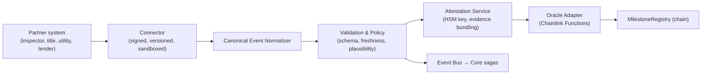

# DSN-03 — Oracle & Integration Layer

| | |
|---|---|
| **Doc ID** | DSN-03 |
| **Version** | 0.1.0-draft · 2026-06-11 |
| **Status** | Draft for founder review |

The declared core asset (README §3A): curated connectors + canonical events + attestation, delivering verified real-world milestones to contract logic. Substrate: Chainlink Functions/CCIP behind our adapters (ADR-0008).

## 1. Layer Anatomy

Two consumption paths by design: **every** validated event reaches Core sagas (off-chain truth for workflows); only **trust-events** — those that gate funds or legal milestones — continue to attestation + chain (README Module E: "off-chain data refresh w/o on-chain writes" is the default path).

## 2. Connector Lifecycle (the moat, operationalized — README §3A.2)

| Stage | Contents | Exit gate |
|---|---|---|
| 1. Application | Partner identity, licensing evidence, service description | Partner Ops screen |
| 2. Vetting | Licensing verification, security questionnaire + evidence, data-handling audit, sanctions/OFAC check, reference checks | Vetting dossier approved (four-eyes) |
| 3. Build & certify | Partner implements against the Connector SDK (typed adapter interface, semver); certification suite in sandbox: schema conformance, latency SLOs, failure behavior, idempotency | All certification checks green |
| 4. Signing | Artifact hashed + signed by platform release key; egress allowlist fixed; resource quotas set | Signature + allowlist recorded |
| 5. Production | Runs in Connector Host (isolated subnet, ARC-07 §7.5); per-connector metrics, anomaly detection (volume, value distributions, error patterns) | Continuous |
| 6. Offboarding | Triggered by monitoring breach, vetting lapse, or contract end; signature revoked, traffic drained, open milestones reassigned/escalated | Post-offboarding review |

Anomaly→action policy: anomalies **suspend the connector and escalate**; they never silently drop or auto-correct events (README fail-safe; R-13 mitigations: this whole table).

## 3. Canonical Event Schema (descriptive)

Every event entering business or chain logic conforms to:

| Field group | Contents |
|---|---|
| Identity | event id (UUIDv7), canonical type (taxonomy below), schema version |
| Provenance | source connector + version, partner id, upstream ref, capture timestamp, **observed-at vs. effective-at** distinction |
| Subject | entity refs (lease / unit / transaction / party-role — never raw PII) |
| Payload | type-specific fields, validated; large evidence → object storage, hash here |
| Assurance | tier (see §4), evidence hash(es), attester signatures |
| Integrity | normalizer signature, audit-log seq ref |

Initial taxonomy: `identity.kyc.*`, `screening.*`, `funds.{received,settled,frozen}`, `inspection.{scheduled,passed,failed}`, `walkthrough.{completed,confirmed}`, `title.{searched,clear,defect}`, `county.{recorded,rejected}`, `utility.{transferred}`, `lease.{signed,activated,terminated}`, `issuer.{freeze,unfreeze}`. Additive evolution only; consumers tolerate unknown optional fields.

## 4. Assurance Tiers & N-of-M Policy

| Tier | Composition | May gate |
|---|---|---|
| T1 — Informational | Single source, no attestation | UI status, analytics |
| T2 — Verified | Connector + normalizer validation + platform attestation | Workflow advancement, notices, small fees |
| T3 — Multi-attested | N-of-M independent attesters (e.g., partner signature + platform + counterparty confirmation) | Escrow state transitions, milestone-gated releases |
| T4 — Human-gated | T3 **plus** explicit human approval (broker/party per policy) | High-value releases, closing disbursement, any override |

Disagreement among attesters at any tier → event parked in ESCALATED, case opened, no contract write (README §3A.3). Geo-walkthrough events cap at T3 and never solely gate large funds (R-09, ARC-06 R6).

## 5. Read Oracles (county/tax mirrors — Phase 2 leaning)

Scheduled pulls of county/tax/title status into PG mirrors with freshness metadata; surfaced with "as of" timestamps; **never authoritative** (ADR-0002). Mirror disagreements with partner-supplied data are escalations, not auto-picks.

## 6. SLOs & Monitoring

Per-connector: availability, p95 latency, schema-violation rate, anomaly score. Layer-wide: event delivery p95 (capture → saga consumption ≤ 60 s; → chain attestation ≤ 15 min for T3), DON job success rate, attestation backlog depth. Breaches page Partner Ops; sustained breach = suspension per §2 stage 6.
