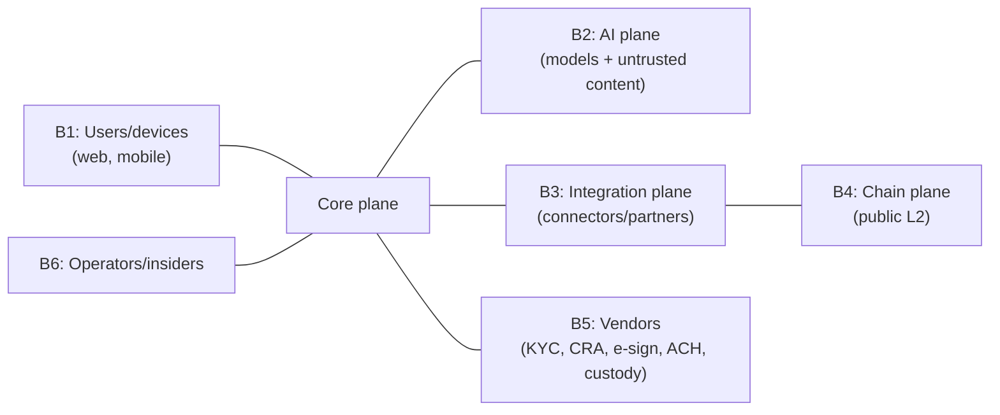

# DSN-05 — Security Threat Model

| | |
|---|---|
| **Doc ID** | DSN-05 |
| **Version** | 0.1.0-draft · 2026-06-11 |
| **Status** | Draft for founder review |
| **Method** | STRIDE per trust boundary; abuse cases; control mapping |

## 1. Assets (what an attacker wants)

A1 escrowed/route-able funds · A2 governance & signing keys (multisig, attestation, anchor, paymaster) · A3 PII + KYC/FCRA artifacts · A4 negotiation secrets (vaults, bids, salts) · A5 audit-log integrity · A6 platform trust/brand (fair-housing record, partner network) · A7 session grants.

## 2. Trust Boundaries

## 3. STRIDE Highlights per Boundary

| Boundary | Top threats | Primary controls |
|---|---|---|
| **B1 Users** | Spoofing (ATO, synthetic identity), geo spoofing (R-09), repudiation of approvals | KYC binding (ARC-08 §8.1); phishing-resistant MFA for fund actions; device attestation + dual confirmation, T3-cap on walkthroughs; approval records w/ e-sign evidence |
| **B2 AI plane** | Prompt injection (TR-01), vault leakage, model-output manipulation, DoS via token burn | DSN-04 §3 stack; per-party contexts (ADR-0016); read-only tools; deterministic proxy; spend quotas + round limits |
| **B3 Integration** | Malicious/compromised connector (R-13), forged events, supply-chain tamper, data exfiltration | Vetting + signing + sandbox + egress allowlists (DSN-03 §2); N-of-M tiers (§4); anomaly suspension; canonical schema rejects out-of-band data |
| **B4 Chain** | Contract exploit (R-06), governance attack, reorg/finality games, MEV/front-running on reveals, sequencer censorship | DSN-02 invariants + audit + bounty; immutable vault + timelock + 3-of-5 (Q2-5); finality policy (ARC-08 §8.4); commit-reveal design reveals at settlement (nothing actionable to front-run); Q6-1 chain-independence of deadlines |
| **B5 Vendors** | Vendor breach (KYC/CRA data), webhook forgery, custody-provider compromise, issuer freeze | Vendor due diligence + DPAs; signed webhooks + replay protection; custody policy engine independence (Q2-1); R5 freeze runbook |
| **B6 Insiders** | Privileged exfiltration, audit tampering, rogue governance, social-engineered support actions | RBAC + four-eyes on sensitive ops (ARC-08 §8.2); hash-chained log + external anchor (A5 defense); geographically-split multisig; access logging on vaults/salts; support actions cannot touch funds without workflow |

## 4. Named Abuse Cases (beyond STRIDE rows)

| # | Abuse case | Disposition |
|---|---|---|
| AC-1 | Landlord encodes discriminatory preference via "neutral" criteria (e.g., ZIP carve-outs as proxy) | Allowlist governance + proxy review (ADR-0009); seller-side optimization features constrained to lawful criteria; paired-test detection; manual review queue |
| AC-2 | Tenant poisons listing Q&A with injection to make landlord-agent under-price | DSN-04 §3; rationale never crosses barrier; anomalous-delta detection |
| AC-3 | Dictionary attack linking on-chain commitments to known listings | ≥128-bit salts off-chain (Q4-3); commitment payload canonicalization includes salts |
| AC-4 | Fake inspection partner attests milestone to release funds | T3 N-of-M requires independent attesters; partner vetting; counterparty confirmation in the set |
| AC-5 | Compromised platform service spams release proposals | Vault accepts proposals only from the bound instructor; counterparty acceptance/challenge window; rate alarms |
| AC-6 | Stolen device approves a deposit release | Step-up auth on fund actions; approval notifications to all channels; challenge window before execution |
| AC-7 | Insider edits audit history after a dispute | Hash chain + daily on-chain anchor → detectable; WORM docs; verification API (Q1-3) |
| AC-8 | Griefing: counterparty never confirms walkthrough to stall deposit | Lapse rules per ruleset (unchallenged window → proceed per statute); escalation path; T4 human gate |

## 5. Security Engineering Baseline

OWASP ASVS-L2 target for the app; secrets in managed vault w/ rotation; SAST/dependency/secret scanning in CI; pen test before GA; SOC 2 Type II program from Increment 1a; incident response runbooks (key compromise, connector compromise, issuer freeze, chain incident) with tabletop exercises pre-mainnet; vulnerability disclosure policy + contract bug bounty (R-06).

## 6. Residual Risks (accepted, monitored)

Sequencer centralization (TR-08, mitigated by rail/deadline independence); LLM jailbreak novelty (defense-in-depth means consequence ceiling is a bad proposal, not fund movement); vendor concentration (quarterly review, ADR-0008/0007); on-chain amount visibility (D-3).
