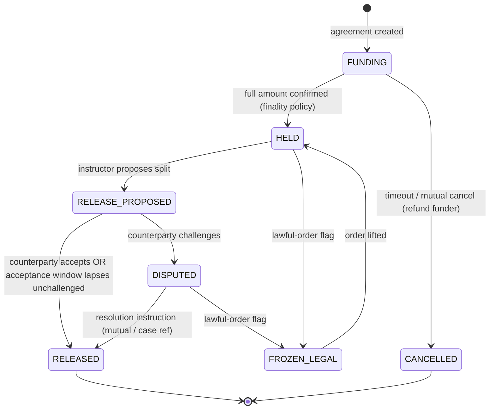

# DSN-02 — Smart-Contract Architecture

| | |
|---|---|
| **Doc ID** | DSN-02 |
| **Version** | 0.1.0-draft · 2026-06-11 |
| **Status** | Draft for founder review — descriptive specification, no code |

Target: EVM L2 (Base, ADR-0005), Solidity, independent audit before mainnet funds (C-T3). Design center: **minimal trust kernel** (ADR-0004) + **immutable vault** (ADR-0014).

## 1. Contract Inventory

| Contract | Mutability | Holds funds? | Purpose |
|---|---|---|---|
| **EscrowVault** | Immutable | **Yes** | Per-agreement stablecoin custody: deposits, earnest money. Releases only to the agreement's predefined party set on authorized instruction. |
| **PaymentRouter** | Upgradeable (timelock) | Transient only | Rent settlement execution within session-grant envelopes (ADR-0017); multi-issuer abstraction; per-issuer circuit breakers (ADR-0006). |
| **LeaseRegistry** | Upgradeable (timelock) | No | Lease reference records: parties (smart accounts), terms hash, schedule parameters, status transitions. |
| **MilestoneRegistry** | Upgradeable (timelock) | No | Attested milestone events: canonical event hash, attester set, evidence hash, assurance tier. Also receives daily audit anchors (ADR-0012). |
| **CommitmentLog** | Upgradeable (timelock) | No | Salted listing/bid commitments + reveals (ADR-0011). |
| **DeedReference (P2)** | Upgradeable (timelock) | No | NFT pointer to county instrument; explicitly non-title (ADR-0002). |
| **Governance stack** | — | No | 3-of-5 multisig → ≥48 h Timelock → periphery upgrades; separate Pauser (multisig, no delay) for halting new operations. |
| **Smart accounts + Paymaster** | Per 4337 ecosystem | User funds | Provider-supplied account implementation (custody variant per ADR-0007); platform paymaster sponsors gas, balance-capped. |

## 2. EscrowVault Specification (the audited heart)

**Agreement structure (set at creation, immutable thereafter):** agreement id; token (issuer allowlisted at creation); party set with role → address bindings (tenant, landlord, platform-fee account, dispute-resolution sink); authorized instructor (the periphery contract bound to this agreement); release-policy id (deposit vs. earnest-money semantics); jurisdiction timer parameters (e.g., statutory return deadline echo — informational, enforcement lives off-chain).

**State machine:**

**Invariants (fuzz/formal targets — ARC-08 §8.8):**

1. **Solvency:** vault token balance ≥ Σ outstanding agreement balances, always.
2. **No arbitrary destination:** every transfer-out lands on an address in the agreement's party set. No admin path violates this — including pause, including any future governance action.
3. **Conservation per agreement:** Σ released + Σ refunded ≤ funded amount; no cross-agreement flows.
4. **Pause safety:** pause blocks state *advancement* and new agreements; it never blocks RELEASED-state withdrawals or mutual-consent refunds (Q2-3).
5. **Instructor confinement:** only the bound instructor may propose; a periphery upgrade cannot rebind existing agreements (ADR-0014).
6. **Freeze idempotence:** FROZEN_LEGAL entry/exit never changes balances.

## 3. PaymentRouter Specification

- Executes rent transfers strictly inside session-grant envelopes (amount/period/payee/expiry — validated on-chain against the grant, not only provider-side).
- **Multi-issuer:** token allowlist with per-issuer state (ACTIVE/SUSPENDED); suspension auto-triggers on issuer freeze signals delivered via oracle (R5 runbook) — suspended issuers block new transfers, never existing withdrawal rights.
- Fee skim: throughput fee (bps, parameterized) routed to the platform fee account in the same settlement — visible on-chain, matching Billing's ledger.
- No balance retention: router holds funds only within a transaction's execution.

## 4. Authorization Matrix

| Action | Tenant acct | Landlord acct | Instructor (periphery) | Attestation svc (oracle) | Governance | Pauser |
|---|---|---|---|---|---|---|
| Fund escrow | ✔ | ✔ | — | — | — | — |
| Propose release/split | — | — | ✔ | — | — | — |
| Accept / challenge split | ✔ | ✔ | — | — | — | — |
| Record milestone | — | — | — | ✔ (N-of-M) | — | — |
| Rent transfer (in envelope) | grant | — | ✔ via router | — | — | — |
| Issuer suspend | — | — | — | ✔ (freeze signal) | ✔ | — |
| Lawful-order freeze | — | — | — | — | ✔ (case ref) | — |
| Pause new ops | — | — | — | — | — | ✔ |
| Upgrade periphery | — | — | — | — | ✔ (timelocked) | — |

## 5. Finality & Gas Policy

- Funds-bearing transitions advance on `CONFIRMED` per the tiered finality policy (ARC-08 §8.4); UI may show `OBSERVED` optimistically with pending badges.
- All user gas sponsored by paymaster (C-T5); paymaster balance-capped + monitored; sponsorship policy denies non-platform call targets.

## 6. Assurance Plan

Slither-class static analysis in CI → Foundry-style unit + invariant fuzzing (the §2 invariant list verbatim) → fork tests on Base Sepolia → testnet soak with simulated cohort (Increment 0) → **independent audit** → bug bounty live before mainnet funds (R-06) → invariant monitors in production (§8.7) mirroring the same list.
