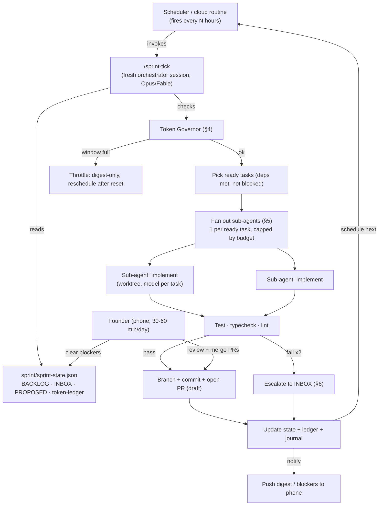

# OPS-01 — Autonomous Operation System ("Fable Manages the Fleet")

| | |
|---|---|
| **Doc ID** | OPS-01 |
| **Version** | 0.1.0-draft · 2026-06-15 |
| **Status** | Draft for founder review |
| **Governs** | The 24/7 self-managed build of the MVP, 2026-06-15 → 2026-06-22 |
| **Companion files** | [sprint/sprint-state.json](../../sprint/sprint-state.json) (the brain) · [.claude/commands/sprint-tick.md](../../.claude/commands/sprint-tick.md) (the procedure) · [PLN-02](../planning/sprint-map.md) (the plan) |

## 1. The Core Problem (and the honest constraint)

A Claude Code agent **only runs when something invokes it**. There is no always-on process "thinking" in the background. So "Fable manages sub-agents 24/7" is implemented as:

> A **scheduler** re-invokes a fresh Claude Code session on a fixed cadence. Each session reads its memory **from disk** (not from a prior context), does one bounded unit of work, writes results back to disk + git, notifies if needed, and exits. Continuity lives in the filesystem, not in a running process.

Everything below is the machinery that makes that loop safe, productive, and self-governing. **Nothing in this system burns tokens until the founder starts it (§9).**

## 2. System Overview

**The brain is the filesystem.** `sprint-state.json` is the single source of truth for what's done, in-flight, blocked, and next. Every tick rehydrates from it; every tick writes back to it. Git history + `sprint/journal/` give the long audit trail.

## 3. The Tick Algorithm

Each scheduled firing runs [`/sprint-tick`](../../.claude/commands/sprint-tick.md). In one sentence: **rehydrate → govern → select → orchestrate → verify → record → notify → reschedule.** Full procedure lives in the command file; the contract is:

1. **Rehydrate** — read `sprint-state.json`, `token-ledger.jsonl` (current window sum), `INBOX.md`, open PRs (`gh pr list`).
2. **Govern** (§4) — if the window soft-cap is hit or a throttle is set and not yet expired → write digest, reschedule, exit. Otherwise compute the fan-out width for this tick.
3. **Select** — choose `todo` tasks whose `deps` are all `done` and which are not `blocked`. Order by priority, then lane balance. Respect `max_concurrent_subagents` and remaining budget.
4. **Orchestrate** (§5) — spawn one sub-agent per selected task, each in its own worktree, on the task's routed model. Monitor to completion.
5. **Verify** — each sub-agent must leave its lane green (`npm run typecheck && lint && test`). The orchestrator double-checks before accepting.
6. **Record** — for each result: create branch, commit, open a **draft PR**; update the task's status (`in_review`), branch, PR link; append a `journal/` entry and a `token-ledger.jsonl` line (with sub-agent token counts).
7. **Notify** (§6) — if anything hit a stop condition, append to `INBOX.md` and push a notification. Always update the rolling digest.
8. **Reschedule** — confirm the next tick is scheduled (or let cron handle it). Exit cleanly. **A tick is short and idempotent** — if it dies mid-way, the next tick re-derives state from disk + git and continues; nothing is lost.

## 4. Token Governor (subscription-cap policy)

The budget answer is **subscription caps**: run hot up to the plan's rolling windows, throttle gracefully when near a limit, resume when it resets. Honest mechanism — there is no precise "tokens remaining" API for a subscription, so the governor is **estimate-based + reactive**, not metered:

| Mechanism | How it works |
|---|---|
| **Pacing (proactive)** | Tick cadence is set so expected burn stays under the rolling-window cap with margin (`rolling_window_hours`, `soft_cap_est_output_tokens_per_window` in state). The orchestrator scales fan-out *down* as the current window fills. |
| **Self-metering (estimate)** | Every tick appends real sub-agent token counts (the harness reports them, e.g. `subagent_tokens: 71601`) to `token-ledger.jsonl`. The governor sums the current window before fanning out. It's an estimate, deliberately conservative. |
| **Reactive backoff (the real safety valve)** | If any call returns a rate/usage-limit error, the tick catches it, sets `throttle_state` with a `resume_after`, writes a digest, and reschedules the next tick **after** the window resets. No failing, no thrash. |
| **Optimal-utilization rule** | "Maximize usage" ≠ burn for its own sake. The governor keeps the fleet busy on *ready* work and routes each task to the cheapest adequate model (§5), so throughput per token is high. Idle only when no task is ready or the cap is reached. |

Tuning: the soft cap (`800k est output tokens / 5h window` as a starting guess) is recalibrated after observing 2–3 real windows — the ledger gives the data. If the founder is on a higher tier, raise it; the loop adapts without code change.

## 5. Sub-Agent Orchestration

The tick session is the **orchestrator**; the work is done by sub-agents it spawns.

- **Fan-out:** one sub-agent per ready task, up to `min(max_concurrent_subagents, budget-allowed, ready-task-count)`. Independent lanes (A/B/C/D) parallelize naturally.
- **Worktree isolation:** code-writing sub-agents run in their own git worktree so parallel lanes never collide on the working tree; clean lanes merge to their branch, untouched worktrees are auto-removed.
- **Model routing (right model per task)** — encoded per task in `sprint-state.json`:
  - **Opus 4.8 / Fable 5** — orchestrator itself; plus hard/sensitive tasks: schema, auth, audit hash-chain, fair-housing guardrail, rent/payment logic, integration, PR synthesis.
  - **Sonnet** — the workhorse: most features, CRUD, adapters, tests, refactors.
  - **Haiku** — bulk/cheap: docs, lint/type fixes, a11y sweeps, summarization.
- **Per-task pipeline:** each sub-agent does implement → self-test → leave-lane-green; the orchestrator then reviews the diff (a cheap Opus pass) before opening the PR. Findings that aren't blocking become PR comments, not rework loops.
- **Monitoring:** the orchestrator waits on its sub-agents, collects structured results, and records token usage per agent. A sub-agent that dies or returns null drops that task back to `todo` with a note — it is retried next tick, not lost.

## 6. Escalation & Daily Digest (the phone interface)

The founder runs this from a phone with ~30–60 min/day. Two channels:

- **Daily digest** (`/sprint-digest`, once each morning): what merged, what's in review (PR links), what's blocked and why, token burn vs. window, and the day's planned tasks. Pushed as a notification + written to `sprint/digest/YYYY-MM-DD.md`.
- **Real-time escalations** (`INBOX.md` + push): only when a **stop condition** (§7) fires. The fleet keeps working other ready tasks — one blocked task parks, it does not halt the sprint.

Notifications use the platform's push mechanism (cloud-routine notifications / the Claude mobile app). The digest is deliberately short and skimmable: **merge these PRs, answer these blockers, everything else is handled.**

## 7. Safety & Scope Control (why this is safe to leave running)

Five hard guarantees, enforced by config + procedure, not by trust:

1. **The backlog is the only source of work.** Agents may decompose `tasks[]` but may **not** invent features. New ideas → `PROPOSED.md` for human triage. This is how "no scope creep" survives an autonomous fleet.
2. **Nothing reaches `main` without the founder.** Branch-per-task, draft PRs, human merge. The loop never merges or force-pushes (git stop condition).
3. **Counsel-gated content is never auto-finalized.** Lease template, adverse-action letter copy, and WA ruleset legal values are built as labeled placeholders; the engine ships, the legal text waits for LGL-01 sign-off.
4. **No money, no secrets, no prod.** MVP holds no funds by design; any task implying real fund movement, a production deploy, or handling a real secret beyond `.env` templates is a hard stop.
5. **Bounded permissions.** [.claude/settings.json](../../.claude/settings.json) allowlists exactly the commands the loop needs (git non-destructive, npm scripts, `gh pr create`, repo-scoped file ops, Supabase migration *generation*) and denies the rest. An unattended run literally cannot run `rm -rf`, force-push, deploy to prod, or apply a destructive migration.

Full stop-condition list is in `sprint-state.json.stop_conditions`. When one fires: finish the safe step, set the task to `in_review`/`blocked`, write to INBOX, notify, keep going on other tasks.

## 8. Cadence

- **Tick cadence:** every **2–3 hours** during the window (≈8–10 ticks/day) — frequent enough to keep lanes saturated, spaced enough to respect the rolling cap. The governor stretches the interval automatically when a window is full.
- **Digest:** once each morning (a fixed local hour).
- **Daily rhythm, June 15→22:** front-load Lane A (platform foundation: auth, audit, CI, ruleset engine) days 1–2 so Lanes B/C/D unblock and parallelize days 3–6; days 6–7 are integration, the landlord dashboard, a11y, hardening, and the demo seed. See [PLN-02](../planning/sprint-map.md) for the day-by-day.

## 9. Start / Stop Procedure (the switch)

**Prerequisites:** PC2 has Claude Code installed and signed in; the GitHub repo is pushed (so PRs work); `.env.local` holds the Supabase + vendor keys; the Claude mobile app is connected for notifications.

**To start the loop** (choose one):
- **Cloud routine (recommended for true 24/7, phone-triggerable):** create a scheduled routine that runs `/sprint-tick` every 2–3 hours and `/sprint-digest` each morning. (Use the `schedule` skill / scheduled-tasks; the exact command is staged in [PLN-02 §6](../planning/sprint-map.md). The founder triggers creation once — it then runs server-side regardless of whether PC2 is awake.)
- **Local loop (PC2 must stay awake):** run `/sprint-tick` on a self-pacing loop on PC2.

**To pause:** set `meta.fleet_status` to `PAUSED` in `sprint-state.json` (the tick checks this first and exits immediately) — or delete/disable the routine.

**To stop:** disable the routine. State, branches, and PRs persist; work resumes exactly where it left off when restarted (state is on disk).

## 10. Failure Modes & Recovery

| Failure | Recovery |
|---|---|
| Tick dies mid-run | Next tick re-derives state from `sprint-state.json` + git + open PRs; idempotent steps mean no double-work. |
| Sub-agent fails/returns null | Task drops to `todo` with a note; retried next tick. |
| Usage limit hit | Reactive backoff (§4); reschedule after reset. |
| Two ticks overlap | Each tick takes a lightweight lock (`sprint/.tick.lock` with a stale timeout); a second concurrent tick exits. |
| Bad merge/conflict between lanes | Worktree isolation prevents most; the orchestrator rebases a lane branch and, if conflicted, parks it to INBOX rather than guessing. |
| State file corrupted | `sprint-state.json` is versioned in git every tick; restore the last good version. |

> This document is the contract. The executable form is [`/sprint-tick`](../../.claude/commands/sprint-tick.md) and [`/sprint-digest`](../../.claude/commands/sprint-digest.md); the data is [sprint-state.json](../../sprint/sprint-state.json). Change the policy here, and update those two in the same change set.
