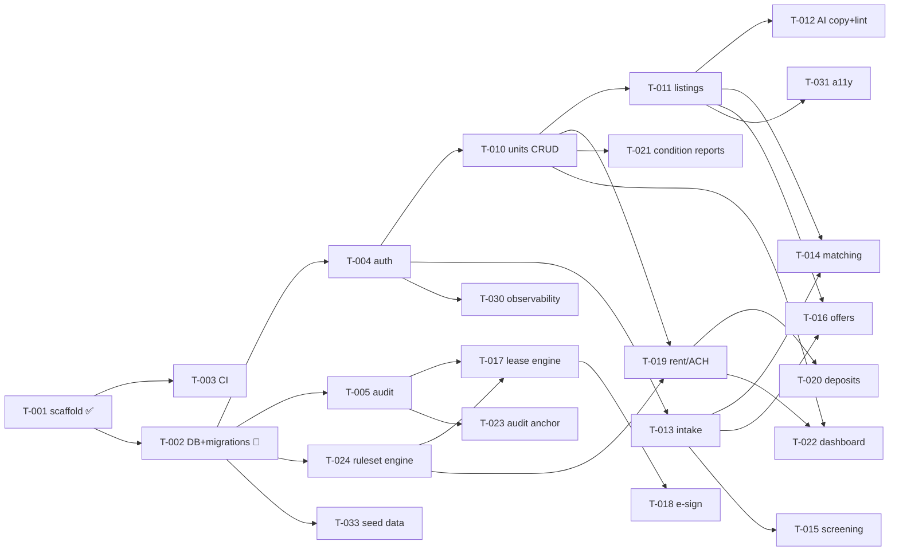

# PLN-02 — Sprint Map (Autonomous Window 2026-06-15 → 2026-06-22)

| | |
|---|---|
| **Doc ID** | PLN-02 |
| **Version** | 0.1.0-draft · 2026-06-15 |
| **Status** | Draft for founder review |
| **Operated by** | [OPS-01](../ops/autonomous-operation.md) (Fable orchestrator + sub-agent fleet) |
| **Backlog** | [sprint/BACKLOG.md](../../sprint/BACKLOG.md) · [sprint/sprint-state.json](../../sprint/sprint-state.json) |

## 1. Goal of the Window

Drive the [PLN-01](mvp-30-day.md) MVP backlog as far as possible in ~7 days of 24/7 autonomous building, **maximizing Fable usage optimally** (high utilization, right model per task, graceful throttling). Target end-state by 2026-06-22:

> A deployable Next.js app where a landlord can sign in, create properties/units, publish a listing; a tenant can apply and be matched (explainably); screening, lease-generation, e-sign, rent/ACH, deposit-documentation, and condition-report flows exist end-to-end against vendor **stubs**; every action is on the live audit trail. **The only thing between "built" and "taking real clients" is counsel sign-off on legal content** (lease template, adverse-action copy, WA ruleset values) — which proceeds on the founder/counsel track in parallel.

This is intentionally ambitious for one week; the loop self-adjusts and the backlog is prioritized so the *most valuable, non-counsel-gated* work always comes first.

## 2. Task Graph (dependencies)

## 3. Day-by-Day (aspirational; the fleet re-plans each tick)

| Day | Date | Primary | Parallel | Founder (30–60 min) |
|---|---|---|---|---|
| 0 | Jun 15 | **Setup (this session):** scaffold, live DB+schema, machinery | — | Review this plan; start the loop (§5) when PC2/phone ready |
| 1 | Jun 16 | Lane A foundation: CI (T-003), auth (T-004), audit (T-005), config (T-006) | — | **Engage counsel** (LGL-01); confirm WA/Seattle (INBOX-3) |
| 2 | Jun 17 | Ruleset engine (T-024), seed (T-033) | Lane B: units CRUD (T-010), intake (T-013) | Review PRs |
| 3 | Jun 18 | Lane B: listings (T-011), matching (T-014), AI copy+lint (T-012) | Lane D: screening (T-015) | Review PRs; vendor keys if available |
| 4 | Jun 19 | Lane C: offers (T-016), lease engine (T-017), rent/ACH (T-019) | Lane A: observability (T-030) | Review PRs |
| 5 | Jun 20 | Lane C: deposits (T-020), condition reports (T-021), e-sign (T-018) | Lane A: audit anchor (T-023) | Review PRs |
| 6 | Jun 21 | Lane D: dashboard (T-022); integration | a11y (T-031), runbooks (T-032) | Review PRs |
| 7 | Jun 22 | Integration hardening, demo polish, window review | drop in counsel content if signed off | End-of-window review |

## 4. Model Routing (optimal usage)

| Work type | Model | Why |
|---|---|---|
| Orchestration, PR review/synthesis, re-planning | **Opus 4.8 / Fable 5** | Judgment, whole-sprint context |
| Schema, auth, audit hash-chain, fair-housing guardrail, rent/payment logic, lease engine, matching | **Opus / Fable** | Correctness- and compliance-critical |
| Most features, CRUD, vendor adapters, listings, offers, deposits, condition reports, tests | **Sonnet** | Fast, capable workhorse — the bulk of tickets |
| Docs, a11y sweeps, lint/type fixes, runbooks, summaries | **Haiku** | Cheap bulk; keeps token/throughput ratio high |

Routing is encoded per task in `sprint-state.json.tasks[].model` and applied by the orchestrator when it spawns each sub-agent.

## 5. Starting the Loop (the switch — staged, not yet pulled)

Per [OPS-01 §9](../ops/autonomous-operation.md). When PC2 + phone remote are live and the repo is pushed:

- **Recommended (cloud routine, true 24/7, phone-triggerable):** create a scheduled routine that invokes `/sprint-tick` every 2–3 hours and `/sprint-digest` each morning local time. Conceptually:
  - `schedule: every 2 hours → /sprint-tick`
  - `schedule: daily 08:00 local → /sprint-digest`
  - The founder triggers creation once (via the `schedule` skill or the Claude app); it then runs server-side independent of PC2's power state, and notifications land on the phone.
- **Alternative (local):** on PC2, run `/sprint-tick` on a self-pacing loop (PC2 must stay awake).

**Until the founder does this, the fleet is STAGED and burns nothing.**

## 6. Definition of Done (window)

- [ ] App deploys (Vercel) and boots with live Supabase.
- [ ] Auth + RLS proven (cross-org denial test green).
- [ ] Landlord: create org/property/unit → publish listing (public page renders).
- [ ] Tenant: apply (AI + form) → matched with per-feature explanation.
- [ ] Screening, lease-engine (placeholder template), e-sign (sandbox), rent/ACH (stub), deposit-documentation, condition-reports flows reachable end-to-end.
- [ ] Audit trail records every state change; daily Merkle root computed.
- [ ] CI green on `main`; every feature arrived via reviewed PR.
- [ ] Counsel-gated content clearly labeled as placeholder; INBOX reflects what's pending sign-off.
- [ ] `sprint-state.json` accurate; token-ledger shows the window's burn.

## 7. Out of Scope This Window (guard against creep)

Stablecoin/escrow/custody, smart accounts, dual-agent negotiation, mobile app, geo-attested walkthrough, property-manager (multi-owner agency) flows, Phase-2 anything. These are post-MVP per [ADR-0019](../adr/ADR-0019-mvp-30-day-concessions.md)/[ADR-0001](../adr/ADR-0001-rental-first-phasing.md). Ideas land in [PROPOSED.md](../../sprint/PROPOSED.md), not in the build.
